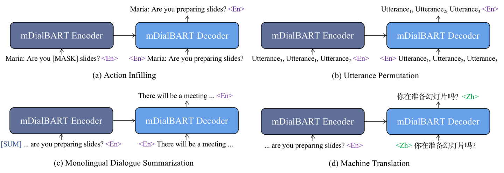
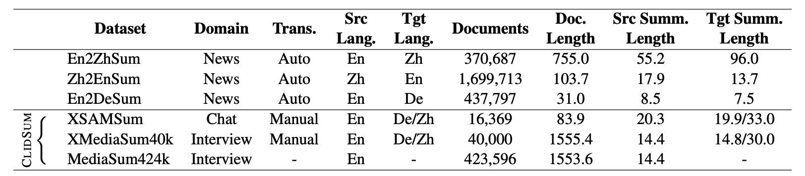

## ClidSum: A Benchmark Dataset for Cross-Lingual Dialogue Summarization
This repository contains the data, codes and model checkpoints for our paper ["ClidSum: A Benchmark Dataset for Cross-Lingual Dialogue Summarization"](https://arxiv.org/abs/2202.05599).   

###  updates
- *2022.10.07*: Our paper is accepted to EMNLP 2022 as a long paper.
- *2022.02.25*: We released our training [code](#finetune-mdialbart).
- *2022.02.23*: We released our [model checkpoints](#model-list) and [model outputs](#model-outputs).
- *2022.02.22*: We released the [ClidSum benchmark dataset](#clidsum-benchmark-dataset).
- *2022.02.14*: We released [our paper](https://arxiv.org/abs/2202.05599). Check it out!

## Quick Links
- [Overview](#overview)
- [ClidSum Benchmark Dataset](#clidsum-benchmark-dataset)
- [Model List](#model-list)
- [Use mDialBART with Huggingface](#use-mdialbart-with-huggingface)
- [Finetune mDialBART](#finetune-mdialbart)
    - [Requirements](#requirements)
    - [Fine-tuning](#finetuning)
    - [Model Outputs](#model-outputs)
    - [Evaluation](#evaluation)
- [Citation and Contact](#citation-and-contact)

## Overview

In this work, we introduce cross-lingual dialogue summarization task and present `ClidSum` benchmark dataset together with `mDialBART` pre-trained language model.
- `ClidSum` contains `XSAMSum`, `XMediaSum40k` and `MediaSum424k` three subsets.    
- `mDialBART` extends mBART-50 via the second pre-training stage. The following figure is an illustration of our `mDialBART`.



## ClidSum Benchmark Dataset  
<ins>**Please restrict your usage of this dataset to research purpose only.**</ins>  

You can obtain `XMediaSum40k` from the [share link](https://drive.google.com/file/d/1ETwdHFKEp-DZYLejHvoMp3CXn-kTsmoB/view?usp=sharing).
For `MediaSum424k`, please refer to the [MediaSum Repository](https://github.com/zcgzcgzcg1/MediaSum/) since `MediaSum424k` is the subset of MediaSum.

For `XSAMSum`, please send an application email to jawang1[at]stu.suda.edu.cn to obtain it. Note that, we cannot directly release the share link of `XSAMSum` due to the [CC BY-NC-ND 4.0 license](https://creativecommons.org/licenses/by-nc-nd/4.0/) of original `SAMSum` dataset. 

The following table shows the statistics of our `ClidSum`.  


  

The format of obtained JSON files is as follows:
```
[
    {
        "dialogue": "Hannah: Hey, do you have Betty's number?\nAmanda: Lemme check\nHannah: <file_gif>\nAmanda: Sorry, can't find it.\nAmanda: Ask Larry\nAmanda: He called her last time we were at the park together\nHannah: I don't know him well\nHannah: <file_gif>\nAmanda: Don't be shy, he's very nice\nHannah: If you say so..\nHannah: I'd rather you texted him\nAmanda: Just text him 🙂\nHannah: Urgh.. Alright\nHannah: Bye\nAmanda: Bye bye",
        "summary": "Hannah needs Betty's number but Amanda doesn't have it. She needs to contact Larry.",
        "summary_de": "hannah braucht bettys nummer, aber amanda hat sie nicht. sie muss larry kontaktieren.",
        "summary_zh": "汉娜需要贝蒂的电话号码，但阿曼达没有。她得联系拉里。"
    },
    {
        "dialogue": "Eric: MACHINE!\r\nRob: That's so gr8!\r\nEric: I know! And shows how Americans see Russian ;)\r\nRob: And it's really funny!\r\nEric: I know! I especially like the train part!\r\nRob: Hahaha! No one talks to the machine like that!\r\nEric: Is this his only stand-up?\r\nRob: Idk. I'll check.\r\nEric: Sure.\r\nRob: Turns out no! There are some of his stand-ups on youtube.\r\nEric: Gr8! I'll watch them now!\r\nRob: Me too!\r\nEric: MACHINE!\r\nRob: MACHINE!\r\nEric: TTYL?\r\nRob: Sure :)",
        "summary": "Eric and Rob are going to watch a stand-up on youtube.",
        "summary_de": "eric und rob werden sich ein stand-up auf youtube ansehen.",
        "summary_zh": "埃里克和罗伯要在youtube上看一场单口相声。"
    },
    ...
]
```
`summary` represents the original English summary of the corresponding `dialogue`. `summary_de` and `summary_zh` indicate the human-translated German and Chinese summaries, respectively.

In addition, as described in our paper, `XMediaSum40k` is constructed based on 40k samples randomly selected from the MediaSum corpus (totally 463k samples). To know which samples are selected, you can find original `ID` of each sample from [train_val_test_split.40k.json](https://drive.google.com/file/d/1gi5Q_P-ANxULualTtZITTJ8YDu6jNQAQ/view?usp=sharing) file.   


License: [CC BY-NC-SA 4.0](https://creativecommons.org/licenses/by-nc-sa/4.0/)

## Model List
Our released models are listed as following. You can import these models by using [HuggingFace's Transformers](https://github.com/huggingface/transformers).   

| Model | Checkpoint |
| :--: | :--: |
| mDialBART (En-De) | [Krystalan/mdialbart_de](https://huggingface.co/Krystalan/mdialbart_de) |
| mDialBART (En-Zh) | [Krystalan/mdialbart_zh](https://huggingface.co/Krystalan/mdialbart_zh) |


## Use mDialBART with Huggingface
You can easily import our models with HuggingFace's `transformers`:

```python
from transformers import MBartForConditionalGeneration, MBartTokenizer, MBart50TokenizerFast

# The tokenizer used in mDialBART is based on the mBART50's tokenizer, and we only add a special token [SUM] to indicate the summarization task during the second pre-training stage.
tokenizer = MBart50TokenizerFast.from_pretrained('facebook/mbart-large-50-many-to-many-mmt', src_lang='en_XX', tgt_lang='de_DE')
tokenizer.add_tokens(['[summarize]']) 

# Import our models. The package will take care of downloading the models automatically
model = MBartForConditionalGeneration.from_pretrained('Krystalan/mdialbart_de')
```

## Finetune mDialBART
In the following section, we describe how to finetune a mdialbart model by using our code.

### Requirements
Please run the following script to install the dependencies:
```
pip install -r requirements.txt
```  

### Code Structure Overview
    .
    ├── run_XMediaSum40k.py
    │
    ├── data
    │   └── XSAMSum
    │   │       ├── train.json
    │   │       ├── val.json
    │   │       └── test.json
    │   └── XMediaSum40k
    │           ├── train.json
    │           ├── val.json
    │           └── test.json
    └── model_output

### Finetuning


```bash
# Finetuning mDialBART on XMediaSum40k (En-De):
python -u run_XMediaSum40k.py \
    --model_path Krystalan/mdialbart_de \
    --data_root data/XMediaSum40k \
    --tgt_lang de_DE \
    --save_prefix mdialbart_de \
    --fp32

# Finetuning mDialBART on XMediaSum40k (En-Zh):
python -u run_XMediaSum40k.py \
    --model_path Krystalan/mdialbart_zh \
    --data_root data/XMediaSum40k \
    --tgt_lang zh_CN \
    --save_prefix mdialbart_zh \
    --fp32

```

Moreover, if you want to fine-tune `mBART-50` by using our code, you should change the `model_path` to mbart-50:  
```bash
# Finetuning mBART-50 on XMediaSum40k (En-De):
python -u run_XMediaSum40k.py \
    --model_path facebook/mbart-large-50-many-to-many-mmt \
    --data_root data/XMediaSum40k \
    --tgt_lang de_DE \
    --save_prefix mbart50_de \
    --fp32

# Finetuning mBART50 on XMediaSum40k (En-Zh):
python -u run_XMediaSum40k.py \
    --model_path facebook/mbart-large-50-many-to-many-mmt \
    --data_root data/XMediaSum40k \
    --tgt_lang zh_CN \
    --save_prefix mbart50_zh \
    --fp32
```


### Model Outputs
Output summaries are available at [outputs](https://github.com/krystalan/ClidSum/tree/main/outputs) directory.   
- `mdialbart_de.txt`: the output German summaries of fine-tuning `mDialBART` on `XMediaSum40k`.
- `mdialbart_zh.txt`: the output Chinese summaries of fine-tuning `mDialBART` on `XMediaSum40k`.
- `mdialbart_de_da.txt`: the output German summaries of fine-tuning `mDialBART` on `XMediaSum40k` with the help of pseudo samples (DA).
- `mdialbart_zh_da.txt`: the output Chinese summaries of fine-tuning `mDialBART` on `XMediaSum40k` with the help of pseudo samples (DA).

### Evaluation
For ROUGE Scores, we utilize the [Multilingual ROUGE Scoring](https://github.com/csebuetnlp/xl-sum/tree/master/multilingual_rouge_scoring) toolkit. The evaluation command like this:
```bash
python rouge.py \
    --rouge_types=rouge1,rouge2,rougeL \
    --target_filepattern=gold.txt \
    --prediction_filepattern=generated.txt \
    --output_filename=scores.csv \
    --lang="german" \ # "zhongwen" for Chinese
    --use_stemmer=true
```

For BERTScore, you should first download the [chinese-bert-wwm-ext](https://huggingface.co/hfl/chinese-bert-wwm-ext) and [bert-base-german-uncased](https://huggingface.co/dbmdz/bert-base-german-uncased) models, and then use the [bert_score](https://github.com/Tiiiger/bert_score) toolkit. The evaluation command like this:

```bash
model_path=xxx/chinese-bert-wwm-ext # For Chinese
model_path=xxx/bert-base-german-uncased # For German

bert-score -r $gold_file_path -c $generate_file_path --lang zh --model $model_path --num_layers 8 # For Chinese
bert-score -r $gold_file_path -c $generate_file_path --lang de --model $model_path --num_layers 8 # For German
```


## Citation and Contact
If you find this work is useful or use the data in your work, please consider cite our paper:
```
@article{Wang2022ClidSumAB,
  title={ClidSum: A Benchmark Dataset for Cross-Lingual Dialogue Summarization},
  author={Jiaan Wang and Fandong Meng and Ziyao Lu and Duo Zheng and Zhixu Li and Jianfeng Qu and Jie Zhou},
  year={2022},
  eprint={2202.05599},
  archivePrefix={arXiv},
  primaryClass={cs.CL}
}
```
Please feel free to email Jiaan Wang (jawang1[at]stu.suda.edu.cn) for questions and suggestions.
